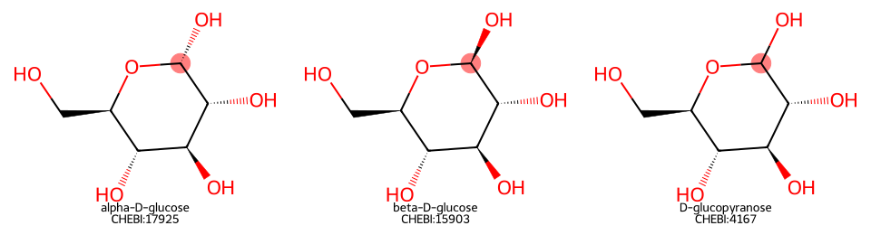
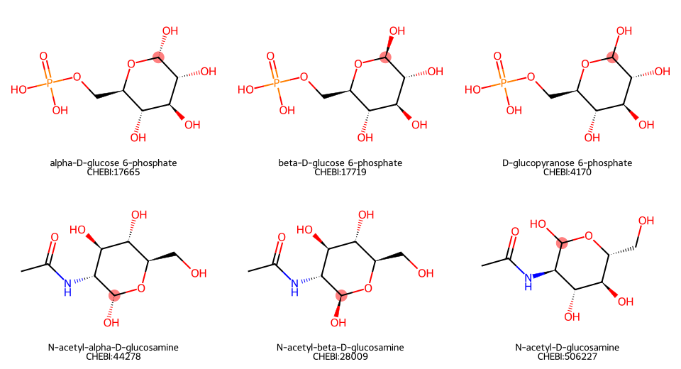
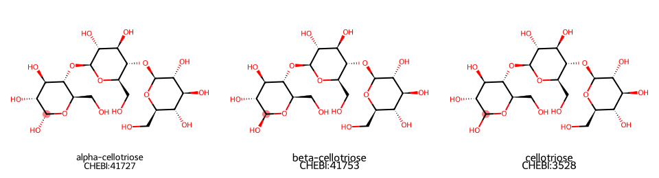
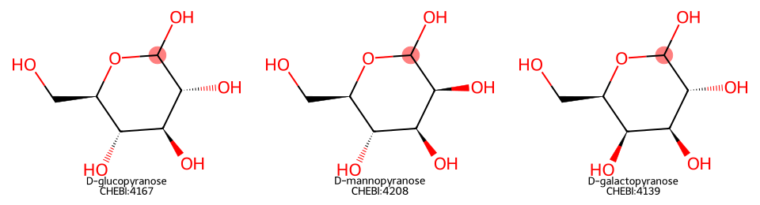
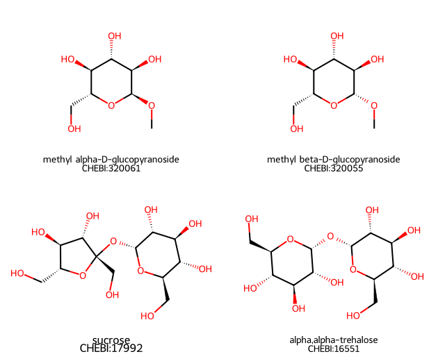
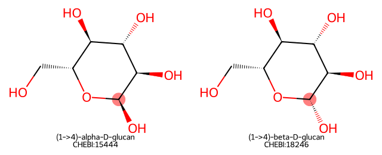
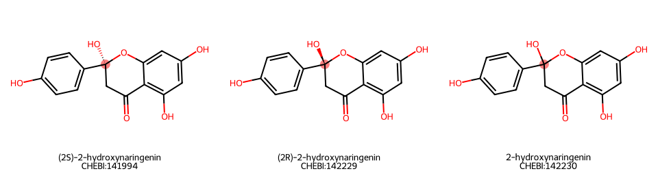

# Free-anomer metabolite harmonization rule

**Status:** Proposal for chemistry review; no production rule has been implemented.

**Proposed Studio name:** `Merge Free Anomeric Forms`

## Decision requested

Should an optional harmonization rule treat the alpha, beta, and anomer-unspecified forms of a **concrete carbohydrate with one free reducing end** as one metabolite when the structures differ only at that free anomeric center?

The first-generation proposal is intentionally narrower than “ignore carbohydrate stereochemistry”:

- Include concrete mono-, modified mono-, and finite oligosaccharides whose structures differ only at one free hemiacetal/hemiketal center.
- Preserve every other stereocenter, so glucose, mannose, and galactose remain distinct.
- Exclude fixed glycosides, nonreducing sugars, polymers/generic structures, D/L pairs, and changes in ring size.
- Initially require a direct ChEBI parent/child relationship as well as agreement after the structure transformation.
- Defer non-carbohydrate cyclic hemiacetals/hemiketals until chemistry review establishes whether the same biological interpretation is appropriate.

This would be an optional harmonization operation. It would not rewrite source evidence or replace the documented and derived InChIKeys stored on the evidence entities.

## Chemical rationale

Alpha- and beta-D-glucopyranose are anomers. In aqueous solution, a molecule with a free anomeric hydroxyl can open to the carbonyl form and close again as either anomer. The resulting change in optical rotation is mutarotation. The rate and equilibrium depend on conditions, so the forms are interconverting rather than literally identical at every instant. See the IUPAC definitions of [mutarotation](https://goldbook.iupac.org/terms/view/M04073) and the [anomeric hydroxy group](https://goldbook.iupac.org/terms/view/09808), and an experimental discussion of [glucose mutarotation kinetics](https://pmc.ncbi.nlm.nih.gov/articles/PMC9969180/).

The same reasoning can apply to the free reducing-end residue of a finite oligosaccharide. IUPAC carbohydrate nomenclature explicitly distinguishes oligosaccharides [with a free hemiacetal group](https://iupac.qmul.ac.uk/2carb/37.html) from those [without one](https://iupac.qmul.ac.uk/2carb/36.html).

It does **not** apply to an alpha/beta descriptor that defines a glycosidic acetal linkage. That configuration is fixed until the covalent bond is broken; it does not interconvert by ordinary mutarotation. See the definitions of a [glycosidic linkage](https://goldbook.iupac.org/terms/view/09825) and [glycosides](https://goldbook.iupac.org/terms/view/G02661).

The operational rule is therefore:

> Merge configurations that differ only at a free reducing-end anomeric hydroxyl. Never discard stereochemistry that belongs to a glycosidic linkage or any other stereocenter.

## Structures proposed for inclusion

The highlighted atom in these diagrams is the free anomeric center detected from the graph SMILES.

### Core test case: D-glucopyranose



These three should form one clique:

- `CHEBI:17925` alpha-D-glucose
- `CHEBI:15903` beta-D-glucose
- `CHEBI:4167` D-glucopyranose, anomer unspecified

Their complete derived InChIKeys differ because the stereochemical block records the anomeric configuration. If chirality is cleared **only** at the detected free anomeric carbon, all three structures produce the same complete normalized key:

`WQZGKKKJIJFFOK-GASJEMHNSA-N`

This is more selective than using the InChIKey connectivity block. The connectivity block alone is also shared by glucose, mannose, galactose, and other stereoisomers.

### Modified reducing monosaccharides



The same structural test identifies a single free anomeric OH while preserving the phosphate, amino/acetamido substitution, and all other stereochemistry. Proposed first-generation examples include:

- alpha-, beta-, and anomer-unspecified D-glucopyranose 6-phosphate;
- alpha-, beta-, and anomer-unspecified N-acetyl-D-glucosamine;
- analogous concrete reducing sugars such as glucosamine, uronic acids, and sialic-acid/hemiketal forms, subject to chemistry review.

### Finite reducing oligosaccharides



Cellotriose illustrates the proposed boundary. Its internal beta-(1→4) linkages remain unchanged. Only the terminal residue with a free anomeric OH changes between alpha, beta, and unspecified forms. The proposal includes this kind of finite, fully specified reducing oligosaccharide.

## Structures that must remain separate

### Other monosaccharide stereochemistry



D-glucose, D-mannose, and D-galactose each have a free anomeric center, but they differ at other stereocenters. Clearing chirality only at the highlighted atom leaves different normalized complete InChIKeys. They therefore remain separate.

The same protection applies to D/L pairs and to any other epimer or stereoisomer whose difference is not confined to the one free anomeric carbon.

### Locked glycosides and nonreducing sugars



These structures have no free anomeric OH that meets the proposed test:

- Methyl alpha- and beta-D-glucopyranoside have anomeric methoxy acetals. They are distinct compounds and do not mutarotate without bond cleavage.
- Sucrose and alpha,alpha-trehalose use both anomeric centers in glycosidic bonds and are nonreducing.

They must not be merged by this rule.

### Polymer and generic carbohydrate records



The first generation should exclude polymer and generic records, including alpha- and beta-glucans. Their alpha/beta designation describes the repeating glycosidic linkage and is biologically consequential, not an equilibrating free-end configuration.

The graph examples above also show a data-quality reason for exclusion: ChEBI supplies monomer-like SMILES for these polymer classes while the formula is `(C6H10O5)n.H2O`. A structure-only detector could mistake that illustrative repeat-unit representation for a discrete reducing sugar. Polymer/generic filters are therefore required even if an apparent terminal OH is present.

### Non-carbohydrate lookalikes: defer in generation one



The graph contains non-carbohydrate cyclic hemiacetal-like structures that pass the local atom pattern. One example is the (2R), (2S), and unspecified 2-hydroxynaringenin group. The structural transformation is analogous, but it is not yet established that these should be treated as one biological metabolite. Generation one should use a carbohydrate scope gate and leave these unchanged.

## Explicit first-generation boundary

| Situation | Generation-one behavior | Reason |
|---|---|---|
| Alpha/beta/unspecified form of one concrete reducing monosaccharide | Include | Interconversion can occur through ring opening/closure |
| Modified monosaccharide with one free anomeric OH | Include | Modification is retained; only free-end chirality is normalized |
| Finite reducing oligosaccharide with one free end | Include | Only terminal free-end configuration changes |
| Glucose versus mannose/galactose | Exclude | Difference occurs at protected stereocenters |
| D versus L form | Exclude | Difference is not confined to the free anomeric center |
| Pyranose versus furanose | Exclude in generation one | Ring connectivity/size differs; this proposal only removes one local chiral assignment |
| Open-chain versus cyclic sugar | Exclude in generation one | Requires a tautomer/ring-chain equivalence rule, not an anomer-only rule |
| Alkyl glycoside or fixed glycosidic linkage | Exclude | Anomeric oxygen is an acetal linkage, not a free OH |
| Nonreducing sugar such as sucrose or trehalose | Exclude | No free reducing end |
| Polymer, repeat unit, wildcard, or formula containing `n` | Exclude | Linkage stereochemistry matters and source structures may be illustrative |
| Generic ontology class without a concrete structure | Exclude | Insufficient structure evidence |
| Non-carbohydrate cyclic hemiacetal/hemiketal | Defer | Chemistry may fit, but desired metabolite identity semantics are unreviewed |

## Proposed matching algorithm

Generation one should be conservative and explainable:

1. Use a direct ChEBI `is_a` child/parent relationship to propose a pair. This connects each alpha or beta term to its anomer-unspecified parent without treating every ontology ancestor as chemical equivalence.
2. Resolve both ChEBI terms to their concrete `MetaboliteIdentifier` structures.
3. Require both records to have parseable SMILES, equal exact molecular formula, and equal formal charge.
4. Require carbohydrate scope and reject polymer/generic records. Initial rejection signals should include wildcard atoms, polymer ontology membership, and formulas containing a repeat variable such as `n`.
5. Detect exactly one free anomeric center: a ring carbon bonded to a ring oxygen and to an external, neutral, degree-one hydroxyl oxygen.
6. Copy each molecule and remove the chiral assignment only from that detected carbon. Do not alter any other atom, bond, isotope, charge, or connectivity.
7. Calculate a complete InChIKey from each normalized copy and require equality. Do not compare only the connectivity prefix.
8. Add the accepted pair to the transient harmonization graph. The alpha and beta children become one clique through their common unspecified parent.
9. Record rule-level explanation data sufficient to audit the merge: ChEBI relationship, source and normalized structures/keys, detected atom index, formula/charge checks, and algorithm version.

Conceptually:

```text
direct ChEBI alpha/beta -> unspecified parent
                  |
                  v
concrete carbohydrate + exact formula/charge + non-polymer
                  |
                  v
exactly one free anomeric OH in each structure
                  |
                  v
clear chirality only there -> calculate full InChIKeys -> equal?
                  |
             yes: transient merge
```

Requiring the ChEBI relationship makes generation one dependent on ontology coverage, but sharply reduces the chance that coincidentally similar structures are merged. A later, separately evaluated version could generate candidates from structures alone.

## Current-graph candidate population

The following exploratory counts come from the `metabolite_harmonization` graph on 2026-08-26. They describe candidate discovery, not approved merges:

- 73,537 `ChemicalEntity` records had a structure and a linked `MetaboliteIdentifier`.
- 3,632 had exactly one atom matching the local free-anomeric-OH pattern.
- Structure-only grouping, with normalized-key and formula checks but without ontology gating, produced 574 possible groups containing 1,361 entities. Inspection showed this is too permissive because it includes polymer/class records and non-carbohydrate lookalikes.
- Direct ChEBI `is_a` relationships plus exact formula and normalized-structure agreement produced 526 candidate child/parent pairs involving 907 entities.
- Those pairs formed 381 connected components: 236 pairs and 145 three-member groups.

The 526-pair result is an **upper bound before a validated carbohydrate/polymer scope filter**. It contains strong examples such as glucose, mannose, galactose, talose, sorbose, arabinose, xylose, rhamnose, sugar phosphates, amino sugars, uronic acids, and finite reducing oligosaccharides. It also contains cases such as hydroxynaringenin that generation one proposes to defer.

## Relationship to existing InChIKey rules

The existing documented and derived InChIKey rules should remain unchanged:

- A documented InChIKey remains source evidence.
- A derived InChIKey remains a reproducible property calculated from source SMILES.
- The proposed rule calculates an additional **transient normalized key** from an in-memory copy of the structure. That key exists only to evaluate this rule and should not overwrite either stored field.
- The full normalized key, not its first connectivity block, is used for the final comparison.

This separation makes the operation reviewable and prevents an anomer-normalized identity from being mistaken for a source assertion.

## Validation plan

Before enabling the rule in a shared pipeline:

1. Produce a complete candidate report with identifiers, names, formulas, original structures/InChIKeys, normalized keys, and the exact ChEBI edge used.
2. Have chemistry reviewers approve categories and flag exceptions, not just the glucose assertion.
3. Build positive tests for glucose, mannose, galactose, glucose 6-phosphate, N-acetylglucosamine, and a finite reducing oligosaccharide.
4. Build negative tests for glucose-versus-mannose/galactose, D/L pairs, pyranose/furanose, methyl glucosides, sucrose, trehalose, alpha/beta glucans, wildcard polymers, and non-carbohydrate lookalikes.
5. Verify that the rule adds no bridge between different normalized complete keys and changes no evidence-layer record.
6. Run it as an optional Studio rule and compare clique deltas against the same pipeline without the rule.
7. Review unexpectedly large cliques and every candidate outside the pre-approved chemical categories before considering it stable.

## Questions for chemistry review

1. Is “rapidly interconverting free-anomer pool under ordinary biological aqueous conditions” the right identity criterion for RaMP harmonization?
2. Should alpha, beta, and unspecified free forms be merged even when a source or enzyme annotation is explicitly anomer-specific?
3. Are modified monosaccharides such as sugar phosphates, amino sugars, uronic acids, and sialic-acid hemiketals acceptable in generation one?
4. Should all finite reducing oligosaccharides be included, or should generation one stop at monosaccharides?
5. Is a ChEBI carbohydrate ontology gate sufficient, and which exact ancestor(s) should define it?
6. Are there concrete polymer records for which a free reducing-end anomer should be represented separately from the linkage-defined polymer class, or should all polymers remain categorically excluded?
7. Are any non-carbohydrate cyclic hemiacetal/hemiketal families appropriate for a later generalized rule?
8. Are there expected exceptions where ring opening is so constrained or slow that merging the free anomers would be misleading?

## Figure provenance

The SVG panels are generated with RDKit from the exact graph SMILES listed in `generate_structures.py` under `designs/assets/metabolite_anomer_rule/`. The highlighted atoms show the current proposed detector, not a manually selected illustration. Regenerating the figures therefore also checks that the detector continues to identify the intended center.
