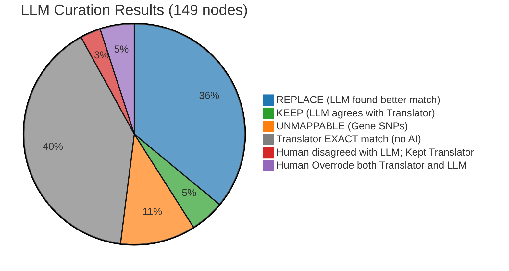

# **LLM Curation Results (Version 251128)**

```mermaid
%%{init: {'theme':'base', 'themeVariables': { 
  'pie1':'#1f77b4',
  'pie2':'#2ca02c',
  'pie3':'#ff7f0e',
  'pie4':'#7f7f7f',
  'pie5':'#d62728',
  'pie6':'#9467bd'
}}}%%
pie title LLM Curation Results (149 nodes)
    "REPLACE (LLM found better match)" : 36
    "KEEP (LLM agrees with Translator)" : 5
    "UNMAPPABLE (Gene SNPs)" : 11
    "Translator EXACT match (no AI)" : 40
    "Human disagreed with LLM; Kept Translator" : 3
    "Human Overrode both Translator and LLM" : 5
```
