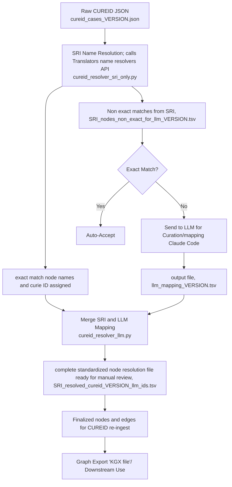

# CUREID Node Resolution Pipeline - Visual Flow

## Overview Diagram

```mermaid
flowchart TD
    A[Raw CUREID JSON<br/>cureid_cases_VERSION.json] --> B

    B[SRI Name Resolution; calls Translators name resolvers API<br/>cureid_resolver_sri_only.py] --> C1[exact match node names and curie ID assigned]
    B --> C2[Non exact matches from SRI, SRI_nodes_non_exact_for_llm_VERSION.tsv]

    C2 --> D{Exact Match?}
    D -->|Yes| E1[Auto-Accept]
    D -->|No| E2[Send to LLM for Curation/mapping <br/>Claude Code]

    E2 --> F[output file, llm_mapping_VERSION.tsv]

    C1 --> G
    F --> G

    G[Merge SRI and LLM Mapping<br/>cureid_resolver_llm.py] --> H[complete standardized node resolution file ready for manual review, SRI_resolved_cureid_VERSION_llm_ids.tsv ]

    H --> I[Finalized nodes and edges for CUREID re-ingest]
    I --> J[Graph Export 'KGX file'/ Downstream Use]
```
