# 🔬 CUREID Node Standardization Pipeline

## What This Pipeline Does
Transforms free-text clinical terms from patient reports into standardized biomedical identifiers that can be used in knowledge graphs and computational analysis.

**Problem:** Patient reports use varied language ("G-tube fed", "difficulty gaining weight", "ACTH therapy")  
**Solution:** Map to standard ontology terms (HP:0011471, HP:0001824, CHEBI:3892)

---

## Pipeline Overview

```mermaid
flowchart TD
    START[📄 Raw Patient Data<br/>cureid_cases_VERSION.json<br/><i>~200 cases with free-text entities</i>] --> SRI
    
    SRI[🤖 Step 1: Automated Mapping<br/>SRI Name Resolver API<br/><i>Queries biomedical databases</i>]
    
    SRI --> EXACT[✅ Exact Matches<br/>Auto-accepted]
    SRI --> NONEXACT[⚠️ Non-Exact Matches<br/>Need review]
    
    NONEXACT --> LLM[🧠 Step 2: AI-Assisted Curation<br/>Claude Code Review<br/><i>Detects errors, suggests corrections</i>]
    
    LLM --> ERRORS{Error Detection}
    
    ERRORS --> SPLIT[🔀 Multi-Concept Split<br/><i>curly hair, sparse eyebrows → 2 terms</i>]
    ERRORS --> ROLE[🎯 Role Mismatch<br/><i>ACTH mapped to PTH → corrected</i>]
    ERRORS --> SPEC[📏 Specificity Issues<br/><i>too broad or too specific</i>]
    ERRORS --> KEEP[✅ Correct Mapping<br/><i>SRI was right</i>]
    
    SPLIT --> LLMOUT[📊 LLM Output<br/>Claude-reviewed mappings<br/><i>with error tags & corrections</i>]
    ROLE --> LLMOUT
    SPEC --> LLMOUT
    KEEP --> LLMOUT
    
    EXACT --> MERGE[📋 Step 3: Merge Results]
    LLMOUT --> MERGE
    
    MERGE --> HUMAN[👤 Step 4: Human QC<br/>Expert Review<br/><i>Validate AI suggestions</i>]
    
    HUMAN --> QC{Review Decision}
    QC --> AGREE[✓ Agree with AI]
    QC --> DISAGREE[✗ Override AI]
    QC --> UNSURE[? Flag for Discussion]
    
    AGREE --> FINAL
    DISAGREE --> FINAL[📑 Finalized Mappings<br/>final_curie_id + final_curie_label<br/><i>Gold standard</i>]
    UNSURE --> FINAL
    
    FINAL --> APPLY[⚙️ Step 5: Apply to Full Dataset<br/>cureid_apply_final_ids.py<br/><i>Re-process original JSON</i>]
    
    APPLY --> OUTPUT[🎯 Standardized<br/>nodes + edges with CURIEs<br/><i>Ready for integration</i>]
    
    OUTPUT --> EXPORT[📤 Export Options]
    EXPORT --> KGX[KGX Format<br/><i>for Translator</i>]
    EXPORT --> Memgraph[Memgraph<br/><i>for graph database</i>]
    EXPORT --> ANALYSIS[Data Analysis<br/><i>for research</i>]
    
    style START fill:#e1f5ff
    style SRI fill:#fff4e1
    style LLM fill:#f0e1ff
    style HUMAN fill:#ffe1e1
    style FINAL fill:#e1ffe1
    style OUTPUT fill:#90EE90
```

---
