# 🔬 CUREID Knowledge Graph Node Standardization Pipeline

## What This Pipeline Does
Transforms free-text clinical terms from patient reports into standardized biomedical identifiers that can be used in knowledge graphs and computational analysis.

**Problem:** Patient reports use varied language ("G-tube fed", "difficulty gaining weight", "ACTH therapy")  
**Solution:** Map to standard ontology terms (HP:0011471, HP:0001824, CHEBI:3892)

---

## Pipeline Overview

```mermaid
flowchart TD
    START[📄 Raw Patient Data<br/>cureid_cases_VERSION.json<br/><i>~200 cases with free-text entities</i>] --> SRI
    
    SRI[🤖 Step 1: Automated Mapping<br/>SRI Name Resolver API<br/><i>Queries biomedical databases</i>]
    
    SRI --> EXACT[✅ Exact Matches<br/>Auto-accepted]
    SRI --> NONEXACT[⚠️ Non-Exact Matches<br/>Need review]
    
    NONEXACT --> LLM[🧠 Step 2: AI-Assisted Curation<br/>Claude Code Review<br/><i>Detects errors, suggests corrections</i>]
    
    LLM --> ERRORS{Error Detection}
    
    ERRORS --> SPLIT[🔀 Multi-Concept Split<br/><i>curly hair, sparse eyebrows → 2 terms</i>]
    ERRORS --> ROLE[🎯 Role Mismatch<br/><i>ACTH mapped to PTH → corrected</i>]
    ERRORS --> SPEC[📏 Specificity Issues<br/><i>too broad or too specific</i>]
    ERRORS --> KEEP[✅ Correct Mapping<br/><i>SRI was right</i>]
    
    SPLIT --> LLMOUT[📊 LLM Output<br/>Claude-reviewed mappings<br/><i>with error tags & corrections</i>]
    ROLE --> LLMOUT
    SPEC --> LLMOUT
    KEEP --> LLMOUT
    
    EXACT --> MERGE[📋 Step 3: Merge Results]
    LLMOUT --> MERGE
    
    MERGE --> HUMAN[👤 Step 4: Human QC<br/>Expert Review<br/><i>Validate AI suggestions</i>]
    
    HUMAN --> QC{Review Decision}
    QC --> AGREE[✓ Agree with AI]
    QC --> DISAGREE[✗ Override AI]
    QC --> UNSURE[? Flag for Discussion]
    
    AGREE --> FINAL
    DISAGREE --> FINAL[📑 Finalized Mappings<br/>final_curie_id + final_curie_label<br/><i>Gold standard</i>]
    UNSURE --> FINAL
    
    FINAL --> APPLY[⚙️ Step 5: Apply to Full Dataset<br/>cureid_apply_final_ids.py<br/><i>Re-process original JSON</i>]
    
    APPLY --> OUTPUT[🎯 Standardized<br/>nodes + edges with CURIEs<br/><i>Ready for integration</i>]
    
    OUTPUT --> EXPORT[📤 Export Options]
    EXPORT --> KGX[KGX Format<br/><i>for Translator</i>]
    EXPORT --> Memgraph[Memgraph<br/><i>for graph database</i>]
    EXPORT --> ANALYSIS[Data Analysis<br/><i>for research</i>]
    
    style START fill:#e1f5ff
    style SRI fill:#fff4e1
    style LLM fill:#f0e1ff
    style HUMAN fill:#ffe1e1
    style FINAL fill:#e1ffe1
    style OUTPUT fill:#90EE90
```

---

## 📊 Detailed Pipeline Steps

### Step 1: Automated Mapping (SRI Name Resolver)
**Tool:** `cureid_sri_resolve.py`

**Input:** Raw CUREID JSON file  
**Process:**
- Extracts all clinical terms (diseases, drugs, phenotypes, genes)
- Queries Translator SRI Name Resolver API
- Gets standardized identifiers from biomedical databases (HPO, MONDO, CHEBI)

**Outputs:**
- ✅ **Exact matches** (~60%): Automatically accepted
- ⚠️ **Non-exact matches** (~40%): Need review → `SRI_nodes_non_exact_for_review_VERSION.xlsx`

**Why some aren't exact:**
- Free-text variations ("G-tube" vs "gastrostomy tube")
- Colloquial language ("anemic" vs "anemia")
- Multi-concept labels ("curly hair and sparse eyebrows")
- Ambiguous terms (API guesses wrong)

---

### Step 2: AI-Assisted Curation (Claude Code)
**Tool:** Claude Code with `LLM_CURATION_PROMPT.md`

**Input:** Non-exact matches file  
**Process:**
Claude Code acts as a biomedical expert and:

1. **Detects Errors:**
   - ❌ **ROLE_MISMATCH**: Wrong anatomy/action (ACTH → PTH)
   - 🔀 **MULTI_CONCEPT_NEEDS_SPLIT**: Multiple terms in one ("A, B, and C")
   - 📏 **OVER/UNDER_SPECIFIC**: Wrong granularity
   - 🔬 **WRONG_ONTOLOGY**: Disease term for phenotype

2. **Suggests Corrections:**
   - Searches reference files (HPO, MONDO) when available
   - Applies biomedical knowledge for drugs/rare diseases
   - Proposes better CURIEs and explains why

3. **Documents Decisions:**
   - `claude_decision`: KEEP or OVERRIDE
   - `error_tag`: What type of error was found
   - `claude_mapped_curie_list`: Suggested identifier(s)
   - `curation_notes`: Explanation of decision

**Output:** `SRI_nodes_Claude_reviewed_VERSION.xlsx`

---

### Step 3: Merge Results
**Tool:** `cureid_resolver_llm.py` (or manual merge)

**Process:**
- Combine exact matches (from SRI)
- Add Claude-reviewed non-exact matches
- Create complete mapping table

**Output:** `SRI_resolved_cureid_VERSION_llm_ids.tsv`

Contains:
- `original_node_label`: Original free text
- `node_type`: Disease/Drug/Phenotype/etc
- `SRI_node_curie`: SRI's suggestion
- `claude_mapped_curie_list`: Claude's suggestion (if different)
- `error_tag`: What issues were found

---

### Step 4: Human Quality Control (Expert Review)
**Tool:** Excel/Manual Review

**Who:** Domain expert (you!) reviews AI suggestions

**Process:**
For each Claude-reviewed row, add:

1. **`human_decision`**:
   - ✅ `AGREE`: Claude is correct
   - ❌ `DISAGREE`: Override Claude's suggestion
   - ❓ `UNSURE`: Flag for team discussion

2. **`human_comments`**: Notes on decision

3. **`final_curie_id`**: Final approved identifier

4. **`final_curie_label`**: Final approved term

**Focus Areas:**
- High-impact terms (n_edges > 10)
- Error-prone categories (ROLE_MISMATCH)
- Uncertain AI decisions
- Novel/rare concepts

**Output:** `cureid_resolved_full_with_manualQC_final_curie.xlsx`

---

### Step 5: Apply Finalized Mappings
**Tool:** `cureid_apply_final_ids.py`

**Input:**
- Original CUREID JSON
- Finalized mapping table (with human QC)

**Process:**
- Re-parses original JSON from scratch
- Ignores any embedded identifiers in JSON
- Applies finalized CURIEs and labels to all nodes and edges
- Flags any nodes missing final mappings

**Outputs:**
- `cureid_edges_final_VERSION.tsv`: Complete knowledge graph

**Columns include:**
- `subject_final_curie` / `object_final_curie`: Standardized IDs
- `subject_final_label` / `object_final_label`: Standard terms
- `biolink_predicate`: Relationship type
- `report_id`, `pmid`: Provenance
- QC flags for missing mappings
---

## 🎯 Quality Assurance Measures

### 1. Reference File Constraints - Generated by ODIN
- HPO: ~20,000 valid phenotype terms
- MONDO: ~26,000 valid disease terms
- **Prevents hallucination** of invalid identifiers

### 2. Error Detection Categories
Systematic tagging of:
- Anatomical mismatches
- Action/verb errors  
- Specificity problems
- Ontology misuse

### 3. Multi-Layer Validation
- ✅ SRI API (automated)
- ✅ Claude AI (semi-automated)
- ✅ Human expert (final approval)

### 4. Provenance Tracking
Every mapping preserves:
- Original free-text label
- SRI suggestion
- AI suggestion
- Human decision
- Error tags
- Comments/notes
