# CUREID Node Resolution Pipeline - Visual Flow

## Overview Diagram

## Critical Errors Fixed by Manual Curation

```mermaid
flowchart LR
    A[Wrong Anatomy<br/>Nipples → Incisors ❌] --> Fix1[HP:0006610<br/>Wide intermamillary distance ✅]
    B[Wrong Action<br/>Gaining → Bearing ❌] --> Fix2[HP:0001824<br/>Poor weight gain ✅]
    C[Wrong Body System<br/>G-tube → Eustachian ❌] --> Fix3[HP:0011471<br/>Gastrostomy tube feeding ✅]
    D[Wrong Hormone<br/>ACTH → PTH ❌] --> Fix4[CHEBI:3892<br/>Corticotropin ✅]

    style Fix1 fill:#99ff99
    style Fix2 fill:#99ff99
    style Fix3 fill:#99ff99
    style Fix4 fill:#99ff99
    style A fill:#ff9999
    style B fill:#ff9999
    style C fill:#ff9999
    style D fill:#ff9999
```

## Quality Metrics (Version 251128)

## Vocabulary Preferences by Node Type

## Manual vs Automated Approach

```mermaid
flowchart LR
    subgraph Automated["❌ Automated Script Approach (FAILED)"]
        A1[Pattern Matching] --> A2[Brittle Rules]
        A2 --> A3[Edge Cases]
        A3 --> A4[0% REPLACE<br/>70% KEEP rubber-stamp]
        A4 --> A5[Nipples → Incisors ❌]
    end

    subgraph Manual["✅ Manual Biomedical Reasoning (SUCCESS)"]
        M1[Read TSV] --> M2[Apply Expertise<br/>Per Case]
        M2 --> M3[External Knowledge<br/>Beyond 5 alternates]
        M3 --> M4[40.8% REPLACE<br/>26.8% KEEP]
        M4 --> M5[All Anatomy Preserved ✅]
    end

    Automated -.Failed after<br/>3 attempts.-> Manual

    style Automated fill:#ffcccc
    style Manual fill:#ccffcc
```

## How to View This Diagram

### Option 1: GitHub/GitLab
If you push this file to GitHub or GitLab, the Mermaid diagrams will render automatically.

### Option 2: VS Code
Install the "Markdown Preview Mermaid Support" extension and preview this file.

### Option 3: Online Mermaid Editor
Copy each diagram block to: https://mermaid.live/

### Option 4: Export as PNG/SVG
Use the Mermaid CLI or online editor to export diagrams as images for PowerPoint/email.

---

**Pipeline Owner**: NIH NCATS TargetGraph Team
**Last Updated**: December 2024
**Current Version**: 251128
**Current Performance**: 40.8% REPLACE, 26.8% KEEP, 12.7% MULTI_SPLIT, 19.7% UNMAPPABLE
