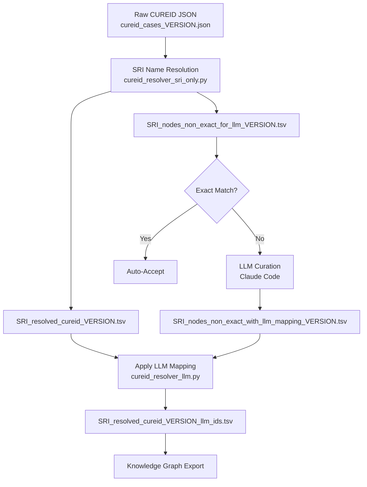
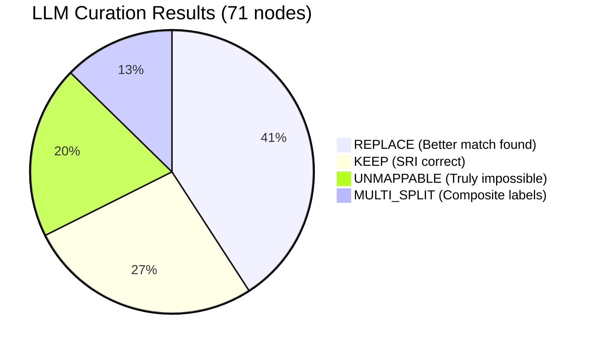

# **CUREID Node Resolution Pipeline**

This document summarizes the full workflow for resolving CUREID patient/clinician free-text nodes into standardized ontology CURIEs suitable for NCATS knowledge graphs/KGX files.

---

# **Pipeline Flow**



---

# **LLM Curation Results (Version 251128)**



---

# **Step-by-Step Summary**

## **1. Raw CUREID JSON**

* Patient/doctor reports contain free-text labels for:

  * Drugs / treatments
  * Diseases / phenotypes
  * Genes & sequence variants
  * Adverse events
* File:
  `data/input/cureid_cases_<VERSION>.json`

---

## **2. Automated SRI Name Resolution**

**Script:** `cureid_resolver_sri_only.py <VERSION>`

**What it does:**

* Extracts all node labels
* Uses Translator SRI Name Resolver
* Returns:

  * `node_curie`
  * `resolved_label`
  * `resolution_score`
  * `exact_match` (Y/N)
  * `alternates_top5` (JSON)

**Outputs:**

* `SRI_resolved_cureid_<VERSION>.tsv`
* `SRI_new_nodes_all_<VERSION>.tsv`
* `SRI_nodes_non_exact_for_llm_<VERSION>.tsv`

**Limitations:**

* Only top 5 alternates
* Semantic errors common (action vs body system vs anatomy)

---

## **3. LLM-Based Expert Curation (Claude Code)**

**Input:** `SRI_nodes_non_exact_for_llm_<VERSION>.tsv`
**Goal:** Correct semantic errors SRI cannot detect.

Curator applies biomedical reasoning for each node, selecting:

* **KEEP** – SRI correct
* **REPLACE** – better ontology term exists
* **MULTI_SPLIT** – label contains multiple concepts
* **UNMAPPABLE** – too vague or inherently unmappable

**Output Columns:**

* `recommendation`
* `split_terms`
* `mapped_curie_list`
* `mapped_label_list`
* `mapping_notes`

**Output File:**
`SRI_nodes_non_exact_with_llm_mapping_<VERSION>.tsv`

---

## **4. Apply LLM Curation to Edge Table**

**Script:** `cureid_resolver_llm.py <VERSION>`

Creates final columns:

* `llm_subject_id`, `llm_object_id`
* `llm_subject_label`, `llm_object_label`
* `final_subject_curie`, `final_object_curie`
* `final_subject_label`, `final_object_label`

**Output:**
`SRI_resolved_cureid_<VERSION>_llm_ids.tsv`

---

# **Curation Categories**

### **KEEP**

SRI is semantically correct.

### **REPLACE**

Better ontology match exists (often not in top 5 alternates).

### **MULTI_SPLIT**

Label contains multiple independent concepts.

### **UNMAPPABLE**

Ambiguous, unusable, or free-text variant notation.

---

# **Run Instructions**

```bash
# Step 2: Run SRI resolver
python cureid_resolver_sri_only.py <VERSION>

# Step 3: LLM-based curation using Claude Code
# Claude loads TSV, reasons per-row, writes curated TSV

# Step 4: Apply curated mappings
python cureid_resolver_llm.py <VERSION>
```

Final file:
`data/output/SRI_resolved_cureid_<VERSION>_llm_ids.tsv`

---

# **Files Reference**

### **Inputs**

* `cureid_cases_<VERSION>.json`

### **Intermediate**

* `SRI_resolved_cureid_<VERSION>.tsv`
* `SRI_new_nodes_all_<VERSION>.tsv`
* `SRI_nodes_non_exact_for_llm_<VERSION>.tsv`

### **Outputs**

* `SRI_nodes_non_exact_with_llm_mapping_<VERSION>.tsv`
* `SRI_resolved_cureid_<VERSION>_llm_ids.tsv`


