# 🔬 AREDS/AREDS2/Cataract Metabolomics to Drug Discovery Pipeline

## What This Pipeline Does

Transforms metabolomic study results into actionable drug repurposing candidates through systematic integration across multiple databases and knowledge systems.

**Problem:** Clinical metabolomic studies (AREDS, AREDS2, Cataract) identify significant metabolites, but translating these findings into therapeutic targets requires multi-database integration and pathway-level analysis.

**Solution:** Automated computational pipeline that standardizes metabolite identifiers, maps to biological pathways, discovers protein targets, analyzes interaction networks, and identifies FDA-approved drugs for potential repurposing.

**Result:** Multiple pathway-associated gene sets identified across different study populations, with druggable targets (Tclin/Tchem) and FDA-approved drug candidates mapped for each analysis.

---

## Study Populations & Input Files

This pipeline has been applied to multiple independent cohorts:

| Study | Population | Input File | Association Type |
|-------|-----------|------------|------------------|
| **AREDS** | Age-Related Macular Degeneration | `AREDS_ME_lateAMD_agemalesmkedu.csv` | Positive & Negative |
| **AREDS2** | Age-Related Macular Degeneration (replication) | `AREDS2_ME_lateAMD_agemalesmkedu.csv` | Positive & Negative |
| **Cataract Study** | Cataract (3 populations) | `cataract_sig_mets.csv` | Various |

Each input represents significant metabolites identified through statistical analysis (adjusted for age, sex, smoking, education).

---

## Pipeline Overview

```mermaid
flowchart TD
    INPUT[📄 Study Input Files<br/>AREDS/AREDS2/Cataract<br/><i>Significant metabolites from IC collaborator</i>] --> RESOLVE
    
    RESOLVE[🔍 Stage 1: ID Resolution<br/>Multi-API Harmonization<br/><i>SRI, MyChem, NCATS Resolver</i>]
    
    RESOLVE --> HMDB[✅ Standardized IDs<br/>HMDB identifiers<br/><i>normalized metabolite list</i>]
    
    HMDB --> RAMP[🧬 Stage 2: Pathway Enrichment<br/>RaMP R Package Analysis<br/><i>Haley's custom filters</i>]
    
    RAMP --> PATHWAYS{Enriched Pathways<br/>per study population}
    
    PATHWAYS --> AREDS_POS[AREDS Positive<br/><i>associated pathways</i>]
    PATHWAYS --> AREDS_NEG[AREDS Negative<br/><i>associated pathways</i>]
    PATHWAYS --> AREDS2_POS[AREDS2 Positive<br/><i>replication cohort</i>]
    PATHWAYS --> AREDS2_NEG[AREDS2 Negative<br/><i>replication cohort</i>]
    PATHWAYS --> CAT[Cataract Cohorts<br/><i>3 populations</i>]
    
    AREDS_POS --> PATHWAY_LIST
    AREDS_NEG --> PATHWAY_LIST
    AREDS2_POS --> PATHWAY_LIST
    AREDS2_NEG --> PATHWAY_LIST
    CAT --> PATHWAY_LIST
    
    PATHWAY_LIST[📋 Pathway Lists<br/><i>WikiPathways IDs</i>]
    
    PATHWAY_LIST --> EXAMPLE[Example Pathways:<br/>WP4595 - Urea cycle<br/>WP4157 - GABA metabolism<br/>WP4519 - Cerebral acidurias]
    
    EXAMPLE --> SQL[🎯 Stage 3: Target Discovery<br/>RaMP SQL Query<br/><i>pathway → gene mapping</i>]
    
    SQL --> GENES[📋 Gene Lists<br/><i>N genes per study population</i><br/>ALDH7A1, ABAT, CPS1, MAOB...]
    
    GENES --> PHAROS[⚕️ Stage 4: Druggability Annotation<br/>Pharos GraphQL<br/><i>TDL classification</i>]
    
    PHAROS --> TDL{Target Development Level}
    
    TDL --> TCLIN[Tclin<br/><i>Clinically approved</i>]
    TDL --> TCHEM[Tchem<br/><i>Chemical tools</i>]
    TDL --> TBIO[Tbio<br/><i>Biological evidence</i>]
    TDL --> TDARK[Tdark<br/><i>Understudied</i>]
    
    TCLIN --> STRING
    TCHEM --> STRING
    TBIO --> STRING
    TDARK --> STRING
    
    STRING[🕸️ Stage 4b: PPI Network<br/>STRING-DB API<br/><i>protein interactions</i>]
    
    STRING --> VIZ[📊 Network Visualization<br/>PyVis interactive HTML<br/><i>TDL-colored nodes</i>]
    
    TCLIN --> DRUGS[💊 Stage 5: Drug Mining<br/>Pharos Ligands Query<br/><i>isdrug=True filter</i>]
    
    DRUGS --> OUTPUT[🎯 Drug Candidates<br/>FDA-approved drugs<br/><i>per study population</i>]
    
    VIZ --> EXPORT[📤 Deliverables per Study]
    OUTPUT --> EXPORT
    
    EXPORT --> TSV[Data Tables<br/><i>CSV/TSV formats</i>]
    EXPORT --> HTML[Interactive Viz<br/><i>network browser</i>]
    EXPORT --> REPORT[Analysis Reports<br/><i>per population</i>]
    
    style INPUT fill:#e1f5ff
    style RESOLVE fill:#fff4e1
    style RAMP fill:#f0e1ff
    style SQL fill:#e1ffe1
    style PHAROS fill:#ffe1f0
    style DRUGS fill:#ffe1e1
    style OUTPUT fill:#90EE90
```



---

## Detailed Stage Breakdown

### Stage 1: Metabolite ID Resolution & Harmonization

**Owner:** You  
**Status:** ✅ Complete (multiple runs)

Receive significant metabolites from IC collaborator for each study population. Apply multi-database resolution strategy to standardize chemical identifiers.

**Tools Used:**
- Translator SRI Name Resolver API
- MyChem.info (InChIKey-based lookups)
- NCATS Internal Chemical Resolver
- Python script: `areds_metabo.py`

**Key Outputs:**
- `AREDS_sig_metabolites_sri.csv` (or equivalent for each study)
- `AREDS2_sig_metabolites_sri.csv`
- `cataract_sig_metabolites_sri.csv`
- Harmonized HMDB identifiers
- Normalized metabolite lists for pathway analysis

**Processing Details:**
- Batch processing with retry logic
- Confidence score tracking
- Multiple API cross-validation
- Rate limiting to respect API quotas

---

### Stage 2: Pathway Enrichment Analysis

**Owner:** Haley  
**Status:** ✅ Complete (multiple runs)

Apply RaMP R package with custom filters to identify enriched biological pathways from normalized metabolite lists. Run separately for each study population and association direction.

**Tools Used:**
- RaMP R Package
- Custom enrichment filters (parameters TBD by Haley)

**Analysis Runs:**
1. **AREDS Positive** - Metabolites positively associated with late AMD
2. **AREDS Negative** - Metabolites negatively associated with late AMD
3. **AREDS2 Positive** - Replication cohort, positive associations
4. **AREDS2 Negative** - Replication cohort, negative associations
5. **Cataract Populations** - Three independent cataract study populations

**Example Pathways Identified (AREDS Positive):**
- WP4595 - Urea cycle and associated pathways
- WP4157 - GABA metabolism (GHB)
- WP4519 - Cerebral organic acidurias, including diseases
- Additional AREDS-specific pathways

**Note:** Each study population yields different pathway enrichment results reflecting distinct metabolomic signatures.

**ACTION ITEM:** Haley to document specific filter parameters and methodology for each analysis run.

---

### Stage 3: Target Gene Discovery

**Owner:** You  
**Status:** ✅ Complete (multiple runs)

Query RaMP database directly via SQL to retrieve genes associated with enriched pathways for each study population. Initial Pharos pathway data was found to be outdated, necessitating direct database approach.

**Tools Used:**
- RaMP SQL Database (direct queries)
- Pharos GraphQL API (TDL annotation)

**Key Outputs (per study):**
- Gene symbol lists (N genes per population)
- `pharos_gene_tdls.tsv` files with TDL classifications
- Includes key enzymes and metabolic regulators

**TDL Classifications:**
- **Tclin** - Clinically approved drug targets
- **Tchem** - Targets with chemical tool compounds
- **Tbio** - Targets with biological evidence
- **Tdark** - Understudied proteins

**Technical Note:** Direct SQL queries against RaMP database proved more reliable than Pharos pathway mappings due to more current pathway-gene associations.

---

### Stage 4: Protein-Protein Interaction Network Analysis

**Owner:** You  
**Status:** ✅ Complete (multiple runs)

Retrieve PPI data from STRING database, annotate with Pharos TDL classifications, and create interactive network visualizations colored by druggability status.

**Tools Used:**
- STRING-DB API (PPI network retrieval)
- Pharos GraphQL (TDL enrichment)
- PyVis (interactive network visualization)
- Jupyter Notebook: `Pos_GeneList_PharosTDL_STRING_PPI_Network.ipynb`

**Key Outputs (per study):**
- STRING PPI network data (TSV format)
- Interactive HTML network with TDL color coding
  - Tclin nodes: Blue
  - Tchem nodes: Green
  - Tbio nodes: Orange
  - Tdark nodes: Red
- Static network images from STRING
- TDL distribution statistics

**Network Analysis Features:**
- Functional clustering identification
- Hub protein detection
- Potential combination therapy targets
- Protein interaction confidence scores

---

### Stage 5: Drug Repurposing Candidate Discovery

**Owner:** You  
**Status:** ✅ Complete (multiple runs)

Query Pharos for FDA-approved drug ligands targeting Tclin genes to identify repurposing opportunities specific to each study population's pathway signature.

**Tools Used:**
- Pharos GraphQL (ligands endpoint)
- Drug filtering (`isdrug=True` for FDA-approved only)

**Key Outputs (per study):**
- `pos_target_ligands_drugs.csv` (or equivalent naming)
- Gene-drug association tables
- SMILES structures for all drugs
- Drug-target binding information

**Example Drug Candidates (AREDS Positive):**
- Valproic acid (ALDH5A1)
- Phenelzine (MAOB)
- Carglumic acid (CPS1)
- Cilastatin (DPEP1)
- Additional candidates per study

**Cross-Study Analysis Opportunity:** Compare drug candidates across AREDS/AREDS2/Cataract to identify common therapeutic targets.

---

## Data Flow Summary

### Metabolite-to-Drug Pipeline

```
Study Input (CSV)
    ↓
Metabolite Names → Multi-API Resolution → HMDB IDs
    ↓
HMDB IDs → RaMP Enrichment → WikiPathways IDs
    ↓
WikiPathways IDs → RaMP SQL → Gene Symbols
    ↓
Gene Symbols → Pharos → TDL Labels
    ↓
Gene Symbols → STRING → PPI Network
    ↓
Tclin Genes → Pharos Ligands → FDA-Approved Drugs
    ↓
Final Deliverables (per study)
```

### Study-Specific Branches

Each input file generates:
1. Unique metabolite ID mappings
2. Distinct pathway enrichment results
3. Population-specific gene lists
4. Custom PPI networks
5. Targeted drug candidate sets

---

## Technical Implementation

### Code Assets

**1. `areds_metabo.py`**
- Purpose: Batch metabolite name resolution
- APIs: SRI Name Resolver, MyChem.info, NCATS resolver
- Features: Retry logic, rate limiting, confidence scoring
- Input: `*_sig_metabolites.csv`
- Output: `*_sig_metabolites_sri.csv`

**2. `Pos_GeneList_PharosTDL_STRING_PPI_Network.ipynb`**
- Purpose: Complete gene-to-network-to-drug pipeline
- Workflow: Load genes → Pharos TDL → STRING PPI → PyVis viz → Drug lookup
- Outputs: Multiple TSV files, interactive HTML, static images
- Reusable across all study populations

**3. RaMP R Scripts** (maintained by Haley)
- Purpose: Pathway enrichment analysis
- Input: Normalized HMDB IDs
- Output: WikiPathways enrichment results
- Documentation pending

### File Naming Conventions

```
Input metabolites:
- AREDS_ME_lateAMD_agemalesmkedu.csv
- AREDS2_ME_lateAMD_agemalesmkedu.csv
- cataract_sig_mets.csv

Resolved IDs:
- AREDS_sig_metabolites_sri.csv
- AREDS2_sig_metabolites_sri.csv
- cataract_sig_metabolites_sri.csv

Gene/TDL data:
- pharos_gene_tdls.tsv

Drug candidates:
- pos_target_ligands_drugs.csv
- (naming varies by analysis)
```

---

## Key Results Summary

### Metabolite Resolution
Successfully harmonized metabolite identifiers across multiple databases (SRI, MyChem, NCATS resolver) for all study populations with high confidence scores.

### Multi-Population Analysis
Pipeline successfully applied to:
- AREDS (positive & negative associations)
- AREDS2 (positive & negative associations)
- Cataract (3 independent populations)

### Pathway Enrichment
Distinct pathway signatures identified for each population, reflecting underlying metabolomic differences between AMD and cataract pathophysiology.

### Target Discovery
Multiple gene lists generated, each representing pathway-associated proteins specific to the study population and association direction.

### Druggability Assessment
Tclin (clinically validated) and Tchem targets identified across all studies, indicating multiple potential therapeutic intervention points.

### Drug Repurposing Opportunities
FDA-approved drug candidates mapped to pathway genes for each population, offering immediate translational research opportunities.

### Network Analysis
PPI network analysis reveals functional clustering and potential combination therapy targets based on protein-protein interactions.

---

## Cross-Study Comparative Analysis Opportunities

### Potential Analyses

1. **Overlapping Pathways**
   - Identify pathways enriched across multiple populations
   - Distinguish AMD-specific vs. general ocular disease pathways

2. **Common Drug Targets**
   - Find genes targeted in both AREDS and cataract analyses
   - Prioritize drugs appearing in multiple study populations

3. **Positive vs. Negative Associations**
   - Compare pathway signatures for protective vs. risk metabolites
   - Identify bidirectional targets

4. **AREDS vs. AREDS2 Concordance**
   - Validate findings across independent cohorts
   - Assess replication of metabolite-pathway-drug associations

5. **Tclin Target Prioritization**
   - Rank targets by study population coverage
   - Focus on multi-population validated targets

---

## Project Status & Next Steps

### Completed Stages
✅ Metabolite ID resolution (all populations)  
✅ Pathway enrichment analysis (all populations)  
✅ Target gene discovery (all populations)  
✅ PPI network generation (all populations)  
✅ Drug candidate identification (all populations)

### High Priority Action Items

1. **Documentation**
   - Haley to document RaMP filter parameters for each analysis
   - Create study-specific results summaries
   - Generate comparison tables across populations

2. **Cross-Study Analysis**
   - Identify overlapping pathways across AREDS/AREDS2/Cataract
   - Create Venn diagrams of shared genes and drugs
   - Statistical analysis of replication across cohorts

3. **Results Review**
   - Schedule meeting with Ewy and IC collaborators
   - Present cross-population findings
   - Prioritize drug candidates for experimental validation

### Medium Priority Action Items

1. **Expand Drug Search**
   - Include Tchem targets in drug candidate search
   - Explore investigational drugs in clinical trials
   - Consider natural products and supplements

2. **Literature Validation**
   - Systematic review of identified drug-disease associations
   - Check for existing evidence in AMD/cataract literature
   - Cross-reference with clinical trial databases

3. **Publication Preparation**
   - Generate publication-quality figures
   - Draft methods section for multi-population analysis
   - Prepare supplementary data tables

### Long-Term Goals

1. **Mechanistic Validation**
   - Design experiments for top drug candidates
   - In vitro pathway validation studies
   - Collaborate with experimental groups

2. **Clinical Translation**
   - Identify candidates suitable for retrospective studies
   - Assess feasibility of prospective clinical trials
   - Engage with clinical ophthalmology collaborators

3. **Pipeline Expansion**
   - Apply to additional metabolomic datasets
   - Integrate with genomic/proteomic data
   - Develop automated pipeline for new studies

---

## Project Team & Contacts

### NCATS Team
- **Principal Investigator:** Ewy
- **Bioinformatician (ID Resolution, Target Discovery, Networks, Drugs):** You
- **Pathway Analyst (RaMP Enrichment):** Haley

### Collaborating IC
- **Study Lead:** [To be filled]
- **Metabolomics Analyst:** [To be filled]
- **Clinical Investigators:** [To be filled]

### Study Populations
- **AREDS/AREDS2:** Age-Related Eye Disease Study cohorts
- **Cataract Study:** Three independent populations

---

## Document Information

**Created:** February 2025  
**Last Updated:** February 2025  
**Version:** 1.0 - Multi-Population Pipeline Overview

**Repository:** [Internal location]  
**Code Assets:** `areds_metabo.py`, `Pos_GeneList_PharosTDL_STRING_PPI_Network.ipynb`  
**Data Location:** [Internal data directory]

---

## Appendix: Technical Notes

### API Rate Limits
- SRI Name Resolver: ~20 requests/second
- MyChem.info: No strict limit, be respectful
- NCATS Resolver: Internal, no limit
- Pharos GraphQL: Batched queries recommended
- STRING-DB: 1 request/second recommended

### Database Versions
- RaMP: [Version to be documented]
- Pharos: Current production (updated quarterly)
- STRING: v12.0
- WikiPathways: [Version to be documented]

### Compute Requirements
- Metabolite resolution: Standard laptop/desktop
- Pathway enrichment: R environment with RaMP package
- Network analysis: Jupyter notebook environment
- All stages can run on standard workstation

### Data Storage Estimates
- Input files: <10 MB per study
- Intermediate files: ~50 MB per study
- Output files: ~100 MB per study (including visualizations)
- Total project: <1 GB
