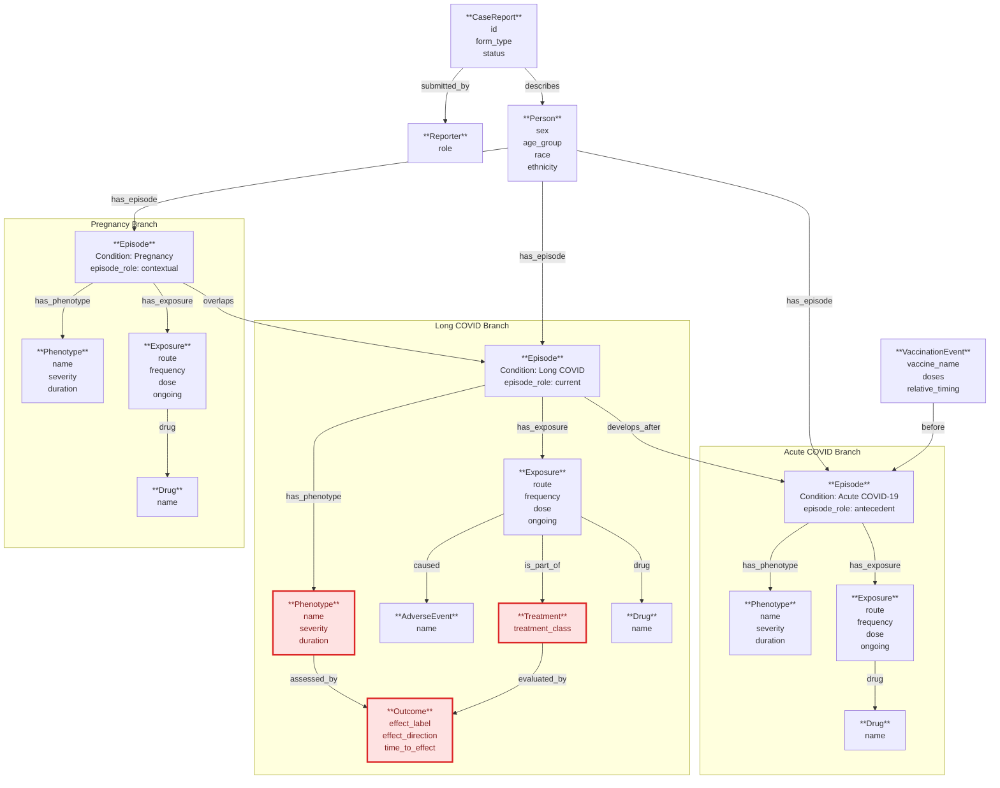

## PASC Conceptual Model

This is a conceptual ER diagram for the `pasc` form family. It is not a direct rendering of `schema.sql`; it reflects the domain concepts and edges discussed from the form structure and exported report data. For PASC specifically, the model is shown in the unconsolidated form with distinct acute COVID, Long COVID, and pregnancy episodes.

